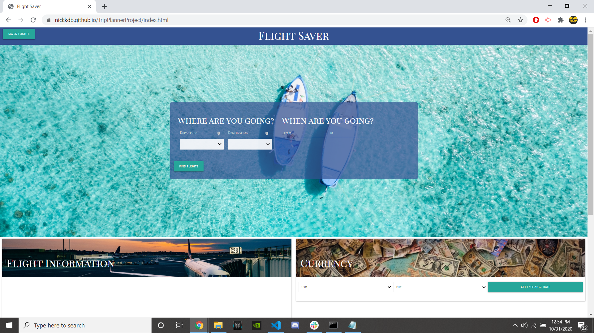

# TripPlannerProject

https://nickkdb.github.io/TripPlannerProject/

This application helps the user plan a trip by allowing them to enter their departing city and destination city as well as date, and get returned information on available flights, weather conditions for their city, and a currency exchange calculator for those traveling out of country. We used 3 APIs to pull data, along with 2 more that made user interactions easier and more interactive. For the front-end, my group used features provided by materialize as well as our own stylings to create a polished, mobile-responsive, easy to operate webpage. On back-end, we fed user data into multiple API calls behind the scenes so the user would have the friendliest experience possible (ie: being able to search by city instead of restricting the search to airport codes). Our progrmaming style was objected-oriented, utilizing arrays of objects to hold necessary flight data and save it if chosen. 

I spent the majority of my time developing this project on the backend, creating the logic and conditions that feed our APIs what they need, and returning it back to the user. Aside from functionality, much of our focus went into debugging, creating proper conditionals for test cases where something goes wrong (ex: no quotes available), and covering the bases for as many input scenarios as we could think of. This project was extremely fun to build and put together by a great group of people, enjoy!!

***The project had 53 commits between all group members during its building, this repo only has 2 as it's a clone for individual submission purposes

